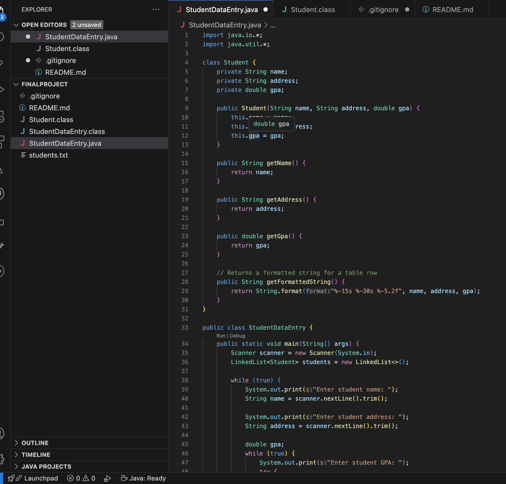
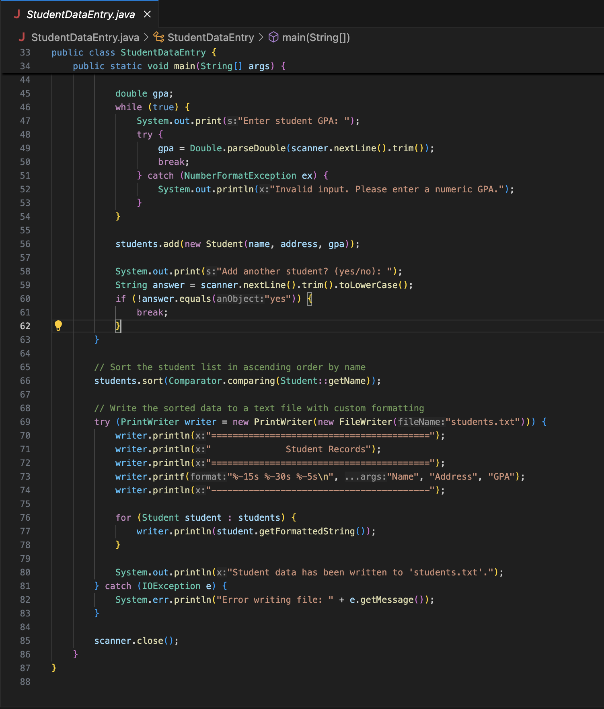
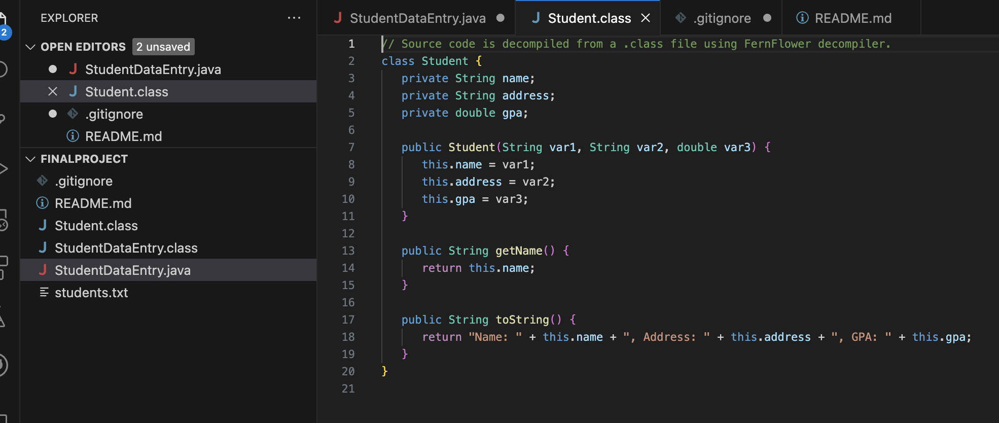
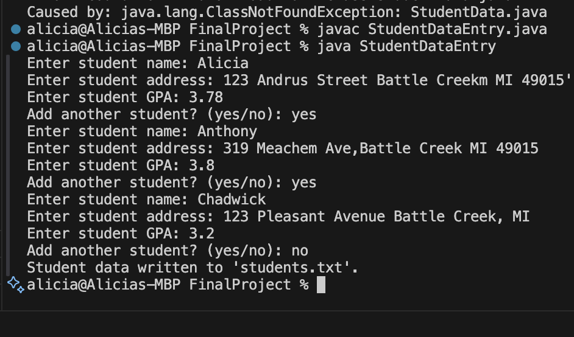
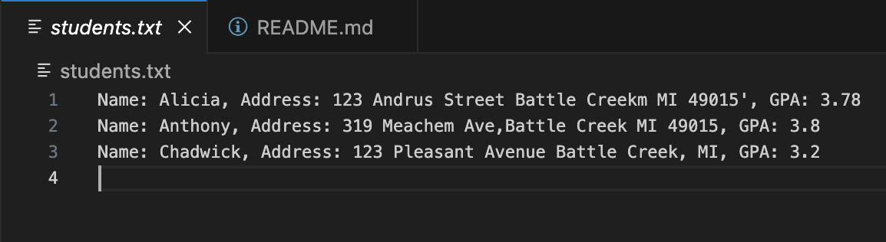

# 💻 Java Student Data Entry Program

This program allows users to enter student data (name, address, GPA) through the console. The data is stored in a linked list, sorted alphabetically by student name, and written to a plain-text file viewable in any editor (e.g., Notepad).

---

## 📁 Project Structure

## How to Run

1. Compiile the program:
    ```bash
    javac StudentDataEntry.java

2. Run the program
    ```bash
    java StudentDataEntry

3. Enter student data when prompted.

4. Check output in students.txt.

## Screenshots

StudentDataEntry.java



Student Class


Output

